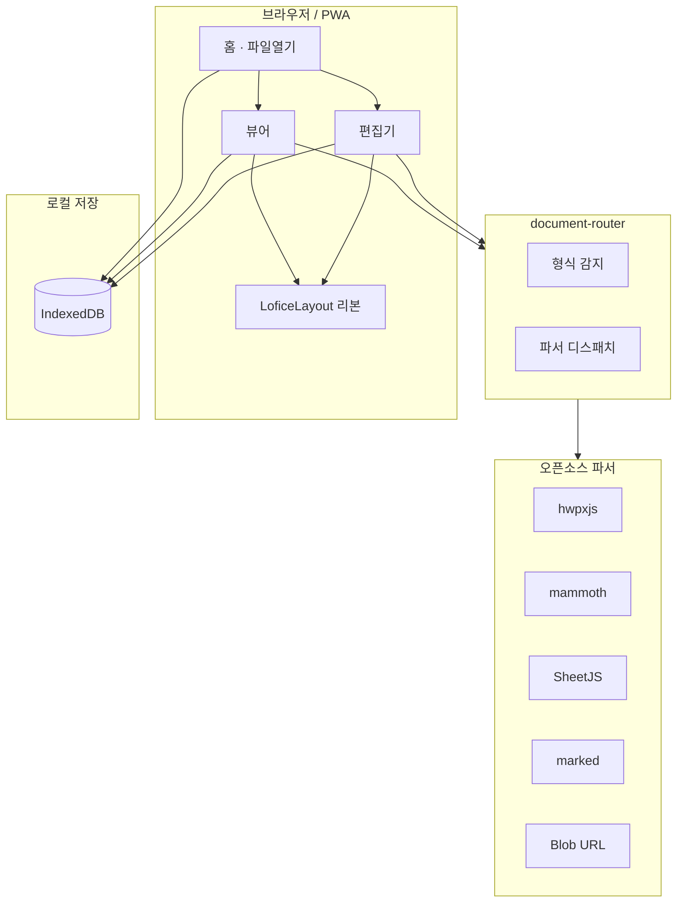

# lofice 개발명세서 (심화 기획안)

> 버전 1.0 · 2026-06-14  
> 기반 분석: [HANCOM 리포](https://github.com/shinkang888-code/HANCOM) (한컴오피스 2020 HOffice110)

---

## 1. 프로젝트 개요

| 항목 | 내용 |
|------|------|
| 제품명 | **lofice** |
| 유형 | 웹앱 기반 통합 문서 뷰어·편집기 (PWA) |
| 배포 | Vercel — `lofice.vercel.app` |
| 법적 원칙 | 한컴 **바이너리/DLL 미사용**, UI·UX만 참고한 **오픈소스 스택 재구현** |

### 1.1 목표

한컴오피스(Hwp/Hword/HCell/HShow/Hpdf)의 **앱 분리 + 공통 필터 엔진 + UxXml 리본 UI** 패턴을 웹으로 전환하여, 브라우저·모바일에서 **거의 모든 문서 형식**을 열람·편집할 수 있는 lofice를 구현한다.

### 1.2 한컴 → lofice 매핑

| 한컴 모듈 | lofice 웹 모듈 | 기술 |
|-----------|----------------|------|
| HNCFilter.dll | `document-router.ts` | 확장자·MIME 라우팅 |
| Hwp.exe / HWP 엔진 | `hancom.ts` + HangulViewer | @ssabrojs/hwpxjs |
| Hword.exe / HncOOXML | `docx.ts` + DocxEditor | mammoth + TipTap |
| HCell.exe | `xlsx.ts` + SpreadsheetEditor | SheetJS |
| Hpdf.exe | PdfViewer | iframe + Blob URL |
| UxXml 리본 | `LoficeLayout.tsx` | React + Tailwind |
| HncDrawingEngine | ScrollCanvas + CSS | 반응형 스크롤 캔버스 |
| ImgFilters | ImageViewer | img + zoom/pan |

---

## 2. 아키텍처



### 2.1 반응형 UI (UxXml → 웹)

- **타이틀바**: lofice 네이비 `#003377` + 골드 악센트 `#D4AF37`
- **리본**: 파일 / 홈 / 보기 / 삽입 — 가로 `overflow-x-auto` (좁은 화면 횡스크롤)
- **문서 영역**: `ScrollCanvas` — 내용에 따라 **상하·좌우 스크롤** 자동
- **모바일**: safe-area, 터치 스크롤, 하단 네비게이션

---

## 3. 지원 형식 명세

### 3.1 뷰어 (P0)

| 형식 | 확장자 | 파서 | 편집 |
|------|--------|------|------|
| 한글 | hwp, hwpx | hwpxjs | ✅ HWPX 저장 |
| Word | docx, doc | mammoth | ✅ TipTap |
| Excel | xlsx, xls, csv | SheetJS | ✅ |
| PDF | pdf | Blob + iframe | ❌ |
| 텍스트 | txt, rtf | TextDecoder | ✅ |
| Markdown | md, markdown | marked | ✅ |
| HTML | html, htm | DOM | ✅ 코드+미리보기 |
| 이미지 | jpg, jpeg, png, gif, webp, bmp, svg | Blob URL | ❌ |
| 데이터 | json, xml | syntax highlight | ✅ |

### 3.2 제한

- 암호화 HWP/HWPX 미지원
- PPTX/ODT 등 — Phase 2
- VBA 매크로 미지원

---

## 4. 페이지 구조

```
/                 홈 · 파일 열기 · 최근 문서
/viewer/?id=      통합 뷰어
/editor/?id=      통합 편집기
/files/           저장된 문서 목록
/settings/        설정
```

---

## 5. 개발 페이즈

| Phase | 내용 | 상태 |
|-------|------|------|
| **0** | 명세·리브랜딩·아이콘·테마 | ✅ |
| **1** | 형식 확장 (이미지/MD/HTML/JSON) | ✅ |
| **2** | LoficeLayout + ScrollCanvas | ✅ |
| **3** | 빌드·Vercel 배포 lofice.vercel.app | 진행 |
| **4** | E2E 테스트·커밋·푸시 | 진행 |

---

## 6. 기술 스택

- **Framework**: Next.js 15 (static export)
- **UI**: Tailwind CSS, Lucide Icons
- **편집**: TipTap (리치텍스트), textarea (MD/HTML/코드)
- **저장**: IndexedDB (로컬 우선)
- **배포**: Vercel Static

---

## 7. 브랜드 가이드

| 요소 | 값 |
|------|-----|
| 로고 | L자 네이비 + 골드 스퀘어 (첨부 아이콘) |
| Primary | `#003377` |
| Accent | `#D4AF37` |
| Ribbon | `#1a3a6b` → `#003377` 그라데이션 |
| 문서 배경 | `#c8c8c8` (한컴 뷰어 회색) |

---

## 8. 검증 체크리스트

- [ ] 홈에서 파일 업로드 → 뷰어 표시
- [ ] HWP/HWPX/DOCX/XLSX/PDF/TXT/MD/HTML/JPG 각각 열림
- [ ] 편집 가능 형식 저장 후 뷰어 재표시
- [ ] 모바일 너비에서 리본 횡스크롤
- [ ] 넓은 표/이미지에서 문서 영역 횡·종 스크롤
- [ ] lofice.vercel.app 접속

---

*본 명세는 HANCOM 분석 리포의 구조 학습을 바탕으로 하며, 상용 소프트웨어 코드를 포함하지 않습니다.*
