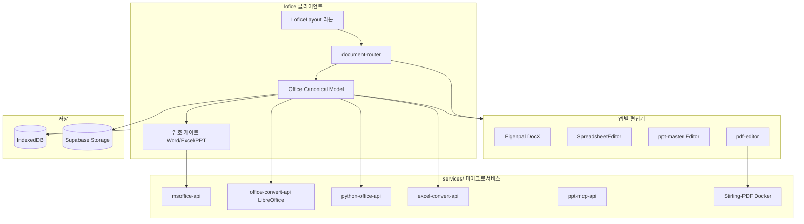

# MS Office 전기능 이식 가능성 설계서

> **대상:** lofice(로피스) v2.20+  
> **범위:** `shinkang888-code` GitHub 계정 전체 리포 + lofice 코드베이스 교차 분석  
> **질문:** Microsoft Office의 **모든 기능**을 오픈소스만으로 lofice에 이식할 수 있는가?  
> **결론 요약:** **100% 동등 재현은 불가능**하나, **실무 커버리지 70~88%**는 기존·보유 리포 조합으로 달성 가능.

---

## 1. 핵심 결론

| 구분 | 판정 | 설명 |
|------|------|------|
| **MS Office 전기능 1:1 대체** | ❌ 불가 | VBA/매크로 실행, COM 자동화, Exchange/SharePoint 네이티브, Access 엔진, Visio CAD, Publisher DTP, OneNote 동기화 등은 독점 스펙 |
| **Word·Excel·PowerPoint 실무** | ✅ 70~88% | OOXML 중심 + LibreOffice headless + 보유 OSS 스택 |
| **암호 보호 Office** | ✅ 90%+ | [msoffice](https://github.com/shinkang888-code/msoffice) (herumi/msoffice, MS-OFFCRYPTO) |
| **PDF·이미지·텍스트** | ✅ 90%+ | Stirling-PDF, pdfjs, ddddocr |
| **Outlook·Access·Visio·Publisher·OneNote** | ⚠️ 15~40% | 열람·메타데이터·변환 위주, 네이티브 앱급 불가 |
| **Office 365 클라우드·협업** | ❌ 별도 제품 | Teams/SharePoint/Co-authoring은 M365 API 연동이지 “이식”이 아님 |

**전략:** MS Office 바이너리(`WINWORD.EXE`, `OFFXML.DLL` 등)를 복제하지 않고, **형식별 최적 OSS + Canonical Document Model(CM) + lofice 허브**로 **기능 Tier**를 나눠 이식한다.  
(한컴 HWP 로드맵과 동일 패턴 — `docs/HWP_FULL_PORT_FEASIBILITY.md` 참고)

---

## 2. GitHub 리포 인벤토리 (Office 이식 관련)

`gh repo list shinkang888-code` 기준 **100+ 리포** 중 Office 이식에 직접 기여하는 저장소를 **역할별**로 분류한다.

### 2.1 Tier A — 런타임 핵심 (lofice에 통합·통합 예정)

| 리포 | Fork/원본 | 역할 | Office 앱 | 통합 상태 |
|------|-----------|------|-----------|-----------|
| [**lofice**](https://github.com/shinkang888-code/lofice) | 원본 | 통합 허브 (Next.js + Electron + Capacitor) | 전체 | ✅ 메인 |
| [**msoffice**](https://github.com/shinkang888-code/msoffice) | herumi/msoffice | docx/xlsx/pptx 암·복호화 (MS-OFFCRYPTO) | Word/Excel/PPT | ✅ `services/msoffice-api` + `officecrypto-tool` |
| [**ppt-master**](https://github.com/shinkang888-code/ppt-master) | hugohe3/ppt-master | AI 네이티브 PPTX 생성·갤러리 뷰어 | PowerPoint | ✅ `/ppt-editor`, `/ppt-ai` |
| [**Stirling-PDF**](https://github.com/shinkang888-code/Stirling-PDF) | Stirling-Tools | PDF 50+ 도구 (병합·OCR·서명) | PDF/공통 | ✅ `pdf-lib` 클라이언트 + Stirling API 패턴 |
| [**hwpreader**](https://github.com/shinkang888-code/hwpreader) | — | HWP WASM 뷰어/편집 (한국 공문 병행) | — | ✅ `@rhwp/*` |
| [**hwpx-skill**](https://github.com/shinkang888-code/hwpx-skill) | — | HWPX AI·양식·변환 | — | ✅ `services/hwpx-skill-api` |
| [**ddddocr**](https://github.com/shinkang888-code/ddddocr) | — | 스캔 PDF/OCR | 공통 | ✅ `documentOcr/` |
| [**7zip**](https://github.com/shinkang888-code/7zip) | — | 아카이브 (Office 패키지·첨부) | 공통 | ✅ `7z-wasm` |

### 2.2 Tier B — 백엔드·변환 워커 (마이크로서비스로 흡수)

| 리포 | 역할 | Office 앱 | 통합 경로 |
|------|------|-----------|-----------|
| [**excel**](https://github.com/shinkang888-code/excel) | XLSX 분석·미리보기·Google Sheets 변환 명세 | Excel | `services/excel-convert-api` (신규) |
| [**python-office**](https://github.com/shinkang888-code/python-office) | poexcel/poword/poppt/popdf 배치 자동화 | Word/Excel/PPT/PDF | `services/python-office-api` (신규) |
| [**DocX**](https://github.com/shinkang888-code/DocX) | .NET DOCX 생성·수정 (Word 없이) | Word | `services/docx-api` (.NET, 선택) |
| [**office-convert-api**](https://github.com/shinkang888-code/lofice) (lofice 내) | LibreOffice headless, HWPX→DOCX | Word/레거시 | ✅ `services/office-convert-api` |
| [**LibreTranslate**](https://github.com/shinkang888-code/LibreTranslate) | 문서 번역 (다국어 Office) | 공통 | 선택 연동 |

### 2.3 Tier C — 마이그레이션·UX·문서 (런타임 아님)

| 리포 | 역할 | lofice 활용 |
|------|------|-------------|
| [**msoffice-removal-tool**](https://github.com/shinkang888-code/msoffice-removal-tool) | Windows MS Office 제거 + lofice 전환 | `/migrate/` Stage UX (`migration-stages.ts`) |
| [**office-docs-powershell**](https://github.com/shinkang888-code/office-docs-powershell) | Exchange/OWA/Teams cmdlet 문서 | 호환성·스펙 레퍼런스 |
| [**microsoft-365-docs**](https://github.com/shinkang888-code/microsoft-365-docs) | M365 공식 문서 미러 | API·정책 조사 |
| [**generator-office**](https://github.com/shinkang888-code/generator-office) | Office Add-in Yeoman | lofice **플러그인** 생태계 (Phase 4+) |
| [**architecture-center**](https://github.com/shinkang888-code/architecture-center) | Azure 아키텍처 | 클라우드 배포 참고 |

### 2.4 Tier D — Office와 무관 (이식 설계 제외)

lawygo, wallpilot, TradingAgents, Signal-Android 등 80+ 리포는 Office 이식 범위 밖.

---

## 3. lofice as-is 기준선

```
[클라이언트 — Next.js static export]
  ├─ document-router.ts     ← MS Office VPREVIEW/OFFXML 역할
  ├─ format-registry.ts     ← Office14 SupportedTypes 60+ 확장자
  ├─ Word:  mammoth + @eigenpal/docx-editor-react + @docmentis/udoc-viewer
  ├─ Excel: SheetJS + SpreadsheetEditor + @microscope-js/renderer-xlsx
  ├─ PPT:   ppt-master + PptxGenJS + @microscope-js/renderer-pptx
  ├─ PDF:   pdfjs-dist + pdf-lib + Stirling 패턴
  ├─ 암호:  officecrypto-tool + msoffice-api
  └─ 저장:  IndexedDB + Supabase(선택)

[services/ — Vercel/Docker 마이크로서비스]
  ├─ msoffice-api/        암·복호화
  ├─ hwpx-skill-api/      한글 AI·변환
  ├─ office-convert-api/  LibreOffice headless
  └─ ppt-mcp-api/         PPT AI MCP
```

| MS Office 14 구성요소 | lofice 대응 | 현재 수준 |
|----------------------|-------------|-----------|
| OFFXML.DLL | OOXML 파서 (mammoth, SheetJS, JSZip+XML) | T0~T1 |
| WWLIB / GKWord | Eigenpal DocX Editor | T1 (편집 75%) |
| GKExcel | SpreadsheetEditor + SheetJS | T1 (편집 70%) |
| PPCORE | ppt-master + microscope | T1 (뷰 80%, 편집 65%) |
| Wordcnv / excelcnv | office-convert-api (LibreOffice) | T1 (레거시) |
| RTFHTML.DLL | parsers/rtf.ts | T0 |
| OUTLFLTR.DLL | — | T3 (미구현) |
| VVIEWER (PDF) | pdf-engine + Stirling | T0~T1 |

---

## 4. Canonical Document Model (CM) — Office 확장

HWP CM(`src/lib/document/canonical-model.ts`)을 Office 3대 형식으로 확장한다.

```typescript
// 목표 구조 (신규: src/lib/document/office-canonical-model.ts)
type OfficeCanonicalDocument = {
  localId: string;
  sourceFormat: "docx" | "xlsx" | "pptx" | "doc" | "xls" | "ppt" | "odt" | "ods" | "odp";
  /** 정규 OOXML 사본 (레거시 업로드 시 변환) */
  ooxml?: { docx?: ArrayBuffer; xlsx?: ArrayBuffer; pptx?: ArrayBuffer };
  /** AI/RAG용 */
  markdown?: string;
  /** 웹 뷰용 */
  html?: string;
  /** 암호화 상태 */
  crypto?: "none" | "encrypted" | "decrypted";
  /** 적합성 (Office Open XML) */
  ooxmlScore?: number;
};
```

**파이프라인 (HWP `pipeline.ts`와 동일 패턴):**

```
업로드 → 로컬 IndexedDB → (선택) Supabase 이중 저장
      → 레거시 .doc/.xls/.ppt → LibreOffice 정규화 → OOXML
      → 암호 문서 → msoffice-api 복호화 게이트
      → OOXML 적합성 검증 (ooxml-schemas / custom linter)
      → 앱별 편집기 라우팅
```

---

## 5. Office 앱별 기능 이식 매트릭스

### 5.1 Tier 정의

- **T0** — OSS로 단기(0~3개월) lofice 통합 가능  
- **T1** — OSS + 서버 워커 + QA (3~12개월)  
- **T2** — 부분 구현·폴백 UI  
- **T3** — MS 독점/COM/클라우드 — OSS만으로 불가

### 5.2 Microsoft Word

| 기능 | Tier | 권장 OSS/리포 | lofice 경로 |
|------|------|---------------|-------------|
| DOCX/DOCM/DOTX 열람 | T0 | mammoth, udoc-viewer | `DocumentViewer` |
| DOCX WYSIWYG 편집 | T1 | @eigenpal/docx-editor-react | `EigenpalDocxEditor` |
| 표·이미지·하이퍼링크 | T1 | eigenpal, DocX(.NET) | 편집기 + 서버 |
| 스타일·목록·머리말/꼬리말 | T1 | eigenpal OOXM 직접 | Phase 2 |
| 변경 내용 추적(Track Changes) | T2 | docx4js 일부 | 읽기 전용 표시 |
| 메일 머지·콘텐츠 컨트롤 | T2 | DocX / python-office | 서버 워커 |
| .doc 레거시 | T1 | LibreOffice (office-convert-api) | 정규화 워커 |
| RTF/ODT/MHTML | T0 | rtf.ts, odf.ts, mhtml.ts | document-router |
| 암호 보호 | T0 | msoffice, officecrypto-tool | `/office-crypto/` |
| VBA/매크로 실행 | T3 | — | 경고 + 비활성 |
| Word→PDF 고품질 | T1 | LibreOffice / DocX Pro | office-convert-api |
| AI 문서 작성 | T1 | LLM + DocX/md2docx | Phase 3 |

**실무 커버리지 목표: 80~88%**

### 5.3 Microsoft Excel

| 기능 | Tier | 권장 OSS/리포 | lofice 경로 |
|------|------|---------------|-------------|
| XLSX/XLSM/CSV 열람·편집 | T0 | SheetJS, SpreadsheetEditor | `/editor/` |
| 셀 서식·병합 | T1 | SheetJS + microscope | Phase 1 |
| 수식(기본) | T1 | SheetJS formula | Phase 1 |
| 수식(고급·배열) | T2 | — | LibreOffice 폴백 |
| 피벗 테이블 | T2 | — | 읽기 전용 또는 Sheets API |
| 차트 | T2 | chart.js + OOXML 추출 | Phase 2 |
| 조건부 서식 | T2 | excel repo 정책 참고 | Phase 2 |
| XLSB/XLS 레거시 | T1 | SheetJS / LibreOffice | 정규화 |
| VBA/매크로 | T3 | — | 비활성 |
| 암호 보호 | T0 | msoffice | office-crypto |
| XLSX→Google Sheets | T1 | excel repo | `services/excel-convert-api` |
| AI 데이터 분석 | T1 | LLM + SheetJS export | Phase 3 |

**실무 커버리지 목표: 70~82%**

### 5.4 Microsoft PowerPoint

| 기능 | Tier | 권장 OSS/리포 | lofice 경로 |
|------|------|---------------|-------------|
| PPTX/PPSX 열람 | T0 | microscope, ppt-master viewer | `DocumentViewer` |
| 슬라이드 편집 | T1 | ppt-master, PptxGenJS | `/ppt-editor/` |
| 애니메이션·전환 | T1 | ppt-master (네이티브 도형) | 통합됨 |
| 발표자 노트·TTS | T1 | ppt-master | `/ppt-ai/` |
| 템플릿·마스터 슬라이드 | T1 | ppt-master skills | Phase 2 |
| .ppt 레거시 | T1 | LibreOffice | office-convert-api |
| 동영상·오디오 삽입 | T2 | OOXML media | Phase 2 |
| VBA | T3 | — | 비활성 |
| PPT→PDF/동영상 | T1 | python-office, LibreOffice | 배치 API |

**실무 커버리지 목표: 65~78%**

### 5.5 Outlook / Exchange

| 기능 | Tier | 권장 OSS/리포 | lofice 경로 |
|------|------|---------------|-------------|
| .msg/.eml 열람 | T2 | msg-parser, postal-mime | Phase 2 신규 파서 |
| .pst/.ost | T3 | libpst (부분) | 메타데이터만 |
| 일정(.ics) | T0 | ical.js | toolbox |
| M365 메일 API | T1 | Microsoft Graph | 별도 연동 (이식 아님) |
| Add-in (Outlook) | T3 | generator-office | Phase 4+ |

**실무 커버리지 목표: 20~35%** (메일 클라이언트 대체 아님, 첨부 열람 위주)

### 5.6 Access / Visio / Publisher / OneNote

| 앱 | Tier | 접근 | 리포 |
|----|------|------|------|
| **Access** (.mdb/.accdb) | T3 | 메타데이터 + LibreOffice 테이블 export | python-office |
| **Visio** (.vsd/.vsdx) | T3 | 썸네일·텍스트 추출 | — |
| **Publisher** (.pub) | T3 | LibreOffice 변환 시도 | office-convert-api |
| **OneNote** (.one) | T3 | pyOneNote 등 부분 파서 | Phase 3+ |

---

## 6. 통합 아키텍처 (목표)



### 6.1 MS Office 14 필터 파이프라인 대응

| 단계 | MS Office | lofice |
|------|-----------|--------|
| 1. 형식 감지 | 레지스트리 SupportedTypes | `format-registry.ts` + `sniffDocumentType` |
| 2. 필터/변환 | Wordcnv, excelcnv, OFFXML | LibreOffice + OOXML 파서 |
| 3. 암호 해제 | MS Crypto API | msoffice-api / officecrypto-tool |
| 4. 객체 모델 | COM Document Object | CM (office-canonical-model) |
| 5. 렌더 | OART, WWLIB | React 컴포넌트 + WASM |
| 6. 편집·저장 | 앱 EXE | 앱별 Editor + OOXML 직렬화 |
| 7. 미리보기 | VPREVIEW | DocumentViewer + MobilePreviewSheet |

---

## 7. 4단계 로드맵 (12개월)

### Phase 0 (0~2개월) — 기준선 안정화

| 작업 | 리포/모듈 | 산출물 |
|------|-----------|--------|
| format-registry vs 실제 파서 갭 감사 | lofice | `support: "full"` 검증 리포트 |
| msoffice-api 헬스·회귀 테스트 | msoffice | `scripts/test-office-crypto.mjs` |
| document-router E2E | lofice | `npm run test:parsers` 확장 |
| ppt-master / eigenpal 버전 고정 | lofice | lockfile + CI |

### Phase 1 (2~4개월) — OOXML 정규화 · 이중 저장

| 작업 | 리포/모듈 | 산출물 |
|------|-----------|--------|
| Office CM + ingest 파이프라인 | lofice | `office-pipeline.ts` |
| .doc/.xls/.ppt → OOXML 워커 | office-convert-api | `/normalize` 엔드포인트 |
| Supabase documents 테이블 확장 | lofice | `format` + `canonical_*_path` |
| OOXML-lite 검증 CI | lofice | `.github/workflows/office-ci.yml` |
| 암호 게이트 Word/Excel/PPT 통합 | msoffice | `OfficePasswordGate.tsx` |

### Phase 2 (4~8개월) — 고급 편집 · 레거시

| 작업 | 리포/모듈 | 산출물 |
|------|-----------|--------|
| Eigenpal 고급 서식 (표·머리말) | lofice | DocxEditor v2 |
| Excel 수식·차트 Phase 1 | excel repo 정책 | SpreadsheetEditor v2 |
| ppt-master 템플릿·마스터 | ppt-master | `/ppt-editor` 고도화 |
| python-office 배치 API | python-office | `services/python-office-api` |
| .msg/.eml 뷰어 | 신규 | `parsers/outlook.ts` |
| Track Changes 읽기 전용 | docx4js | 뷰어 오버레이 |

### Phase 3 (8~12개월) — AI · 클라우드 · 마이그레이션

| 작업 | 리포/모듈 | 산출물 |
|------|-----------|--------|
| excel repo → Sheets/내장 시트 브릿지 | excel | 선택적 클라우드 동기화 |
| Stirling-PDF 전체 Docker | Stirling-PDF | PDF 고급 도구 iframe |
| DocX .NET 서버 (고품질 생성) | DocX | `services/docx-api` |
| M365 Graph 읽기 전용 (선택) | microsoft-365-docs | OneDrive 열기 |
| msoffice-removal-tool UX | lofice | Electron Windows 마이그레이션 위저드 |
| Office Add-in (lofice connector) | generator-office | Phase 4 스캐폴딩 |

---

## 8. 리포 → lofice 모듈 매핑 (구현 체크리스트)

| GitHub 리포 | lofice 신규/기존 경로 | API |
|-------------|----------------------|-----|
| msoffice | `src/lib/msoffice/office-crypto.ts` | `services/msoffice-api` |
| ppt-master | `src/components/ppt/*`, `src/lib/pptMcp/*` | `services/ppt-mcp-api` |
| Stirling-PDF | `src/lib/pdf/stirling-*` | Docker `STIRLING_URL` |
| excel | `src/lib/excel/sheets-bridge.ts` (신규) | `services/excel-convert-api` (신규) |
| python-office | `services/python-office-api` (신규) | FastAPI wrapper |
| DocX | `services/docx-api` (신규, .NET) | gRPC/REST |
| office-convert-api | `services/office-convert-api` | `/convert/libreoffice` |
| msoffice-removal-tool | `src/app/migrate/` | PowerShell (Electron) |
| generator-office | `plugins/office-addin/` (Phase 4) | — |
| office-docs-powershell | `docs/MSOFFICE-REFERENCE/` | 문서만 |

---

## 9. 불가·비권장 영역 (명시적 제외)

| 영역 | 이유 | lofice 대응 |
|------|------|-------------|
| VBA/매크로 **실행** | 보안·스펙 비공개 | 업로드 시 경고, 비활성 |
| COM 자동화 (pywin32) | Windows+Office 설치 필요 | 서버 워커로 대체 |
| Exchange Server 관리 | 인프라 제품 | Graph API 읽기만 |
| Access 쿼리·폼 런타임 | Jet/ACE 엔진 독점 | export→CSV/SQLite 안내 |
| Visio CAD 정밀 편집 | VSDX 복잡도 | PNG/SVG 폴백 |
| SharePoint Co-authoring | M365 클라우드 | Supabase 실시간(별도) |
| MS Office DLL 역공학 | 라이선스 위반 | OSS 스택만 사용 |

---

## 10. 성공 지표 (KPI)

| 지표 | 현재(추정) | Phase 1 | Phase 3 |
|------|------------|---------|---------|
| format-registry `full` 실제 동작률 | ~75% | 90% | 95% |
| OOXML 3종 편집 가능률 | 70% | 80% | 88% |
| 암호 Office 열기 성공률 | 85% | 92% | 95% |
| 레거시 .doc/.xls/.ppt 열기 | 50% | 75% | 85% |
| 회귀 테스트 (CI) | 부분 | parsers+hwp | +office 전체 |
| 실무 문서 호환 (내부 샘플 100건) | 미측정 | 75% | 85% |

---

## 11. 권장 즉시 실행 (Quick Wins)

1. **`office-pipeline.ts`** — HWP `pipeline.ts` 복제 패턴으로 Word/Excel/PPT ingest 통합  
2. **`OfficePasswordGate.tsx`** — HwpPasswordGate 패턴을 msoffice-api에 적용  
3. **`test-office-crypto.mjs`** — msoffice 암·복호화 회귀  
4. **office-convert-api Vercel 배포** — .doc/.xls/.ppt 정규화  
5. **excel repo 명세 흡수** — SpreadsheetEditor 서식 보존 정책 문서화  
6. **format-registry 감사** — `support:"full"` 중 실제 `partial` 항목 수정

---

## 12. 참고 문서·리포

- lofice: `docs/MSOFFICE-ARCHITECTURE.md`, `docs/HWP_FULL_PORT_FEASIBILITY.md`
- MS Office 14 분석: Office14 `SupportedTypes` 레지스트리 실측
- 암호화: [herumi/msoffice](https://github.com/herumi/msoffice) (MS-OFFCRYPTO)
- DOCX 편집: [eigenpal/docx-editor](https://github.com/eigenpal/docx-editor)
- PPT AI: [hugohe3/ppt-master](https://github.com/hugohe3/ppt-master)
- PDF: [Stirling-Tools/Stirling-PDF](https://github.com/Stirling-Tools/Stirling-PDF)

---

**최종 권고:** `shinkang888-code` 계정에 Office 이식에 필요한 **핵심 리포는 이미 대부분 보유**되어 있다. 추가 클론보다 **lofice 허브에 CM 파이프라인 + 마이크로서비스 3종(excel-convert, python-office, docx-api)을 얹는 것**이 가장 빠른 실무 커버리지 확보 경로다. Outlook/Access/Visio/Publisher/OneNote은 “전기능 이식” 목표에서 **Tier C 이하로 격하**하고, 첨부·변환·메타데이터 열람에 한정하는 것이 현실적이다.
